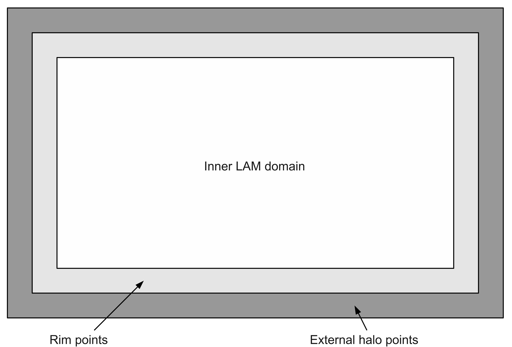

# Lateral Boundary Conditions

In order to run the UM at high resolution over a small domain i.e. as a **Limited Area Model** - LAM, you must specify **Lateral Boundary Conditions** - LBCs to provide time-dependent information to the constrain the solution.

A UM LBC file must contain the following:
- Orography, single level
- Zonal (U) and meridional (V) winds on all (rho) levels
- Vertical (W) wind on all (theta) levels + 1 (extra level at the surface) - Density (rho) on all (rho) levels
- Potential temperature (theta) on all (theta) levels
- Specific humidity (Q) on all (theta) levels
- Specific cloud water content (QCL) on all (theta) levels
- Specific cloud ice content (QCF) on all (theta) levels
- Exner pressure on all (rho) levels + 1 (extra level at the top)

In this document we will use an example LAM with the following resolution:
- 80 columns × 81 rows horizontal grid
- 38 model levels
- 9 point rimwidth
- 5 point external halo size

See image for a schematic.

Taken from https://code.metoffice.gov.uk/doc/um/latest/papers/umdp_C71.pdf